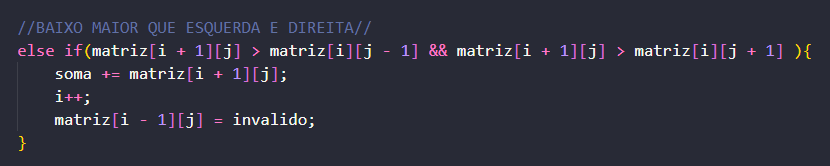

# AEDS-Lista de boas-vindas!

 <h1>Introdução</h1>

Algoritmo guloso (ou míope) é uma solução comum para problemas de otimização, pois realiza a escolha que parece ser a melhor <b>no momento</b>, desde modo, espera-se que uma suceção de boas escolhas irão previnir erros em nível global

Uma matriz é uma estrutura de dados com duas dimensões (i, j) organizada respectivamente em linhas e colunas. A primeira posição da matriz, (matriz[ 0 ][ 0 ]) se encontra sempre no canto superior esquerdo, enquanto a última posição, (matriz[ i ][ j ]) no canto inferior direito. Essa notação mostra que, no caso da <b>primeira</b> posição, se encontra no começo da Linha 0 com a Coluna 0, por isso [ 0 ][ 0 ], enquanto na <b>última posição</b>, ambas já atingiram seu tamanho máximo, digitado pelo ususário. No caso desse algoritmo, apenas trabalharemos com matrizes quadradas, onde o número de linhas é igual ao de colunas. 

<h1>Sobre o projeto</h1>

Nesse projeto, o desafio era fazer um algoritmo que
gerasse uma matriz quadrada ( N x N ) preenchida com valores aleatórios para cada posição, onde 'N' é um número inteiro digitado pelo usuário no 'main.c' e, a partir de sua primeira posição ([ 0 ][ 0 ]), fosse caminhando até a última ([ N ][ N ]), sempre escolhando o "vizinho" de maior valor para dar o próximo passo. Ao atingir o destino, o algoritmo deve apresentar ao usuário o valor de todas as posições que ele passou somadas em um printf("Soma total: X"); 

<h1>Lógica utilizada</h1>
<h2>Criação da matriz</h2>

Para a criação da matriz, foi feita uma função <strong>Cria_Matriz()</strong> que recebe como parâmetro um número inteiro "Tamanho_matriz", coletado no 'main.c' e um inteiro "**matriz", que teve seu devido espaço de memória alocado também no 'main.c' através da função '<code>malloc()</code>'. A matriz é preenchida a partir de 2 loops de for, um de <i>i</i> e o outro de <i>j</i> que, com o auxílio da função externa '<code>rand()</code>' distribui valores aleatórios para cada posição da matriz.
<h2>Movimentação pela matriz</h2>

Para locomover na matriz, foi feita uma função <strong>Anda_Pela_Matriz()</strong> que recebe os mesmos parâmetros que a função anterior. Para esta função, foram criadas duas novas variáveis: um inteiro "soma", que começa recendo o valor da primeira posição da matriz ( soma = matriz[ i ][ j ] <-- Que nesse momento valem 0. ) e uma booleana "invalido" que assume o valor de 'false'.

O <i>while</i> foi escolhido como método para a repetição dos movimentos. Sua condição é que, ele funcionará enquanto a posição atual na matriz, seja diferente da última possível '[ i != Tamanho_matriz && j != Tamanho_matriz ]', garantindo assim que, o programa apenas encerará ao chegar no destino.

O desenvolvimento da lógica de movimentação foi feito com um conjunto de <code>ifs</code> e <code>elses</code>, onde o algoritmo está sempre olhando para os "vizinhos" e comparando o valor para escolher qual próximo passo. O passo em sí é dado a partir de uma manipulaçao do valor de <i>i</i> e <i>j</i>. Na primeira coluna, por exemplo, os únicos movimentos possíveis são de ir para direita ou para baixo, já que não possui mais uma coluna a sua esquerda, a mesma condição acontece quando a posição atual se encontra na ultima coluna, seus movimentos serão limitados a esquerda e baixo.
<h3>Exemplo de verificação e movimentação ⇣</h3> 

Como visto na imagem acima, quando é constatado que o valor de baixo é maior, é aplicado um i++, fazendo com que a posição atual desça uma linha e o valor da variavel "soma" é alterado para += matriz[ i + 1 ][ j ] <--Nesse caso que o movimento é para baixo. Essa lógica se repete do mesmo jeito para os lados, alterando para j-- para se movimentar para <b>esquerda</b> e j++ para <b>direita</b>.

Depois de verificar, avançar uma posição e realizar a atualização do valor da variável "soma", a posição anterior assume o valor da variável 'invalido', que a transforma em 0. Com isso, tirando qualquer possibilidade de entrar em um looping " direita - esquerda " infinito, pois, ele não conseguirá voltar, nunca.